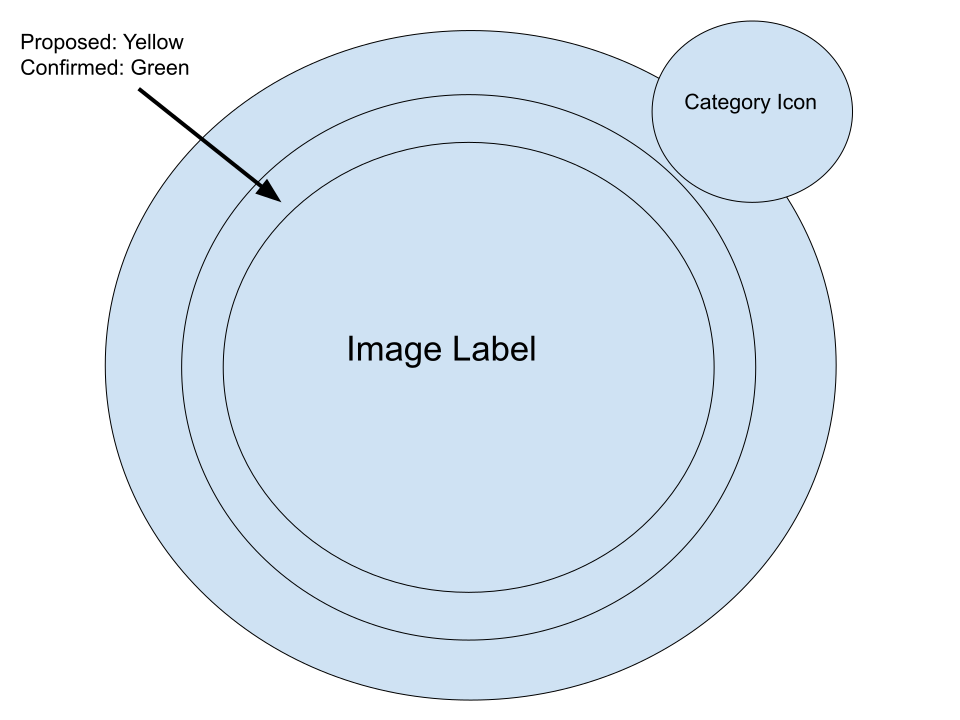

# Roblox Information Board Hardware & UI Spec (Specific Spot & Shop Boards)

This document defines the 3D Parts hierarchy, double-sided UI configuration, dynamic materials/colors, and spatial depth logic for the cylindrical Specific Spot & Shop Boards (../assets/specific-s[...]

---
## 📐 Information Board Layout Diagram

*※ 設計図の元データ・編集は Google Draw 参照*

## 🏗️ 3D Part Hierarchy & Spatial Depth Logic

To support 360-degree viewing (both Front and Back sides) and to create a **convex museum-grade volumetric depth** where the board is thickest at the center, the Cylindrical Parts are layered out w[...]

### Depth & Thickness Distribution (Center-Thick Structure)
1. **Core / Display Layer (Center):** Thickness = `1.0` studs (Thickest)
2. **Inner Status Frame Layer:** Thickness = `0.3` studs
3. **Outer Border Base Layer:** Thickness = `0.1` studs (Thinnest)

```
[Side Profile Depth Concept]
       Outer Base (0.1)   ──┐
 Inner Status Frame (0.3)  ──┼─┐
 Center Display Surface (1.0)──┼─┼─ [ THICK CENTER CORE ]
 Inner Status Frame (0.3)  ──┼─┘
       Outer Base (0.1)   ──┘
```
### Complete Model Hierarchy

    SpecificShopBoard (Model)
    │
    ├── 🔲 Outer_Border (Base Ring)   --> Size: 0.1, 8.0, 8.0 (Shape: Cylinder)
    │   │
    │   ├── 🧱 Inner_Frame (Status Frame) --> Size: 0.3, 6.8, 6.8 (Shape: Cylinder)
    │   │
    │   └── 🖼️ Center_Display_Surface (Thick Core Face) --> Size: 1.0, 6.0, 6.0 (Shape: Cylinder)
    │       ├── 📄 SurfaceGui_Front (Face: Right / CanvasSize: 1024 x 1024)
    │       │   ├── 🖼️ Center_Image_Label (512 x 512, Circle Mask via UICorner)
    │       │   └── 🖼️ PopUp_Info_Frame (Frame / Canvas Overlay - Proximity Activated)
    │       │       ├── 🔤 Spot_Name (TextLabel)
    │       │       └── 🔤 Description (TextLabel)
    │       │
    │       └── 📄 SurfaceGui_Back (Face: Left / CanvasSize: 1024 x 1024 - Future Development)
    │           ├── 🖼️ Center_Image_Label (512 x 512, Circle Mask via UICorner)
    │           └── 🖼️ PopUp_Info_Frame (Frame / Canvas Overlay - Proximity Activated)
    │               ├── 🔤 Spot_Name (TextLabel)
    │               └── 🔤 Description (TextLabel)
    │
    └── 🏷️ Category_Icon (Top-Right Badge) --> Size: 0.2, 2.2, 2.2 (Double-Sided GUI)
        ├── 📄 Category_SurfaceGui_Front (Face: Right / CanvasSize = 256 x 256)
        │   └── 🖼️ Icon_ImageLabel (Category Pictogram)
        └── 📄 Category_SurfaceGui_Back (Face: Left / CanvasSize = 256 x 256 - Future Development)
            └── 🖼️ Icon_ImageLabel (Category Pictogram)

> 💡 **SurfaceGuiのCanvasSize設定（Tips）**:
> `SizingMode` のプロパティを `PixelsPerStud` から `FixedSize` に変更することで、`CanvasSize` プロパティの入力が可能になり、任意の解像度（例: 1024 x 768）[...]
---

## 🎨 Color & Material Setup

The Outer Base uses **Slate Charcoal** for strong visual contrast, while the middle status ring utilizes **Neon Emission** to signal status. Both Front and Back SurfaceGuis share the same dynamic [...]

### Hardware Parts & Materials

| Object | Material | Color (RGB) | Visual Effect & State |
| :--- | :--- | :--- | :--- |
| **Outer_Border (外枠)** | `SmoothPlastic` | `[40, 42, 54]` | Dark Slate Gray (Base ring background) |
| **Inner_Frame (内枠 - Proposed)** | `Neon` | `[255, 204, 0]` | Vivid Yellow Neon Glow |
| **Inner_Frame (内枠 - Confirmed)** | `Neon` | `[0, 230, 118]` | Emerald Green Neon Glow |
| **Center_Display_Surface_Front/Back (中心表示面)** | `SmoothPlastic` | `[18, 18, 24]` | Deep Obsidian Black (Thickest center) |
| **Category_Icon (カテゴリ枠)** | `SmoothPlastic` | `[60, 64, 72]` | Metallic Gray Badge Ring |

### Dynamic UI & Popup Colors (Front & Back Shared)

| UI Element | Color (RGB) | Font / Style | Usage |
| :--- | :--- | :--- | :--- |
| **PopUp Frame Background** | `[15, 17, 23]` (Transparency: 0.15) | Dark Frosted Glass | Contrast backdrop on Outer Border |
| **PopUp Spot Name** | `[255, 255, 255]` | `Montserrat` (Bold, Size 80) | Clear white header text |
| **PopUp Description** | `[220, 225, 230]` | `Source Sans Pro` (Size 80) | Soft white body text |

---

## 📐 UI Layout Architecture (Both Front & Back SurfaceGui)

    ==================================================================
    |               SurfaceGui_Front / Back (1024 x 1024)            |
    |                                                                |
    |                    ┌────────────────────────┐                  |
    |                    │                        │                  |
    |                    │ 🖼️ Center_Image_Label  │                  |
    |                    │    (512 x 512 Circular)│   ┌────────────┐ |
    |                    │                        │   │ Category   │ |
    |                    │   ・Featured Image     │   │ Icon Badge │ |
    |                    │   ・UICorner = 1.0     │   │ (Top-Right)│ |
    |                    └────────────────────────┘   └────────────┘ |
    |                                                                |
    |   ==========================================================   |
    |   | 📁 PopUp_Info_Frame (Triggered via Proximity/Hover)    |   |
    |   |                                                        |   |
    |   |  🔤 Spot_Name (TextSize: 90)                           |   |
    |   |  🔤 Description Text (TextSize: 80 / TextWrapped)      |   |
    |   ==========================================================   |
    ==================================================================

---

## 📁 SurfaceGui Component Details (Front & Back)

### ① 🖼️ Center_Image_Label (Front & Back Face)
* **Purpose**: Displays the shop highlight image or logo on both sides of the center cylinder.
* **Rotation**: 180
* **Size**: `{1.0, 0}, {1.0, 0}` (512 x 512 px)
* **Position**: `{0, 0}, {0, 0}` (Centered horizontally in top half)
* **BackgroundTransparency**: `1`
* **ScaleType**: `Stretch`
* **Child Components**:
  * `UICorner`: `CornerRadius = {1, 0}` (Creates a perfect circle mask)
  * `UIStroke`: `Thickness = 4`, `Color = Status Dynamic (Yellow/Green)`

### ② 🏷️ Icon__Image_Label (Front & Back)
* **Purpose**: Displays a 2D pictogram icon on both sides of the badge to indicate the spot category (e.g., Dining, Shopping).
* **SurfaceGui Setup**: 
  * Front: `Category_SurfaceGui_Front` (`Face = Right`, `CanvasSize = 256 x 256`)
  * Back: `Category_SurfaceGui_Back` (`Face = Left`, `CanvasSize = 256 x 256` - Future Development)
* **Child Components (`Icon_ImageLabel`)**:
  * **Rotation**: 180
  * **Size**: `{1.0, 0}, {1.0, 0}` (204 x 204 px)
  * **Position**: `{0, 0}, {0, 0}` (Centered inside badge)
  * **BackgroundTransparency**: `1`
  * **ImageColor3**: `[255, 255, 255]`
  * **ScaleType**: `Stretch`
  * **Sub-Components**:
    * `UICorner`: `CornerRadius = {1, 0}` (Circular mask fitting badge boundary)
    * `UIStroke`: `Thickness = 2`, `Color = [200, 205, 215]`, `ApplyStrokeMode = Border`

### ③ 📁 PopUp_Info_Frame (Bottom Half Overlay)
* **Type**: `Frame`
* **Purpose**: Triggers independently or synchronously on both sides when a player approaches within 8 studs. Controlled locally via `ShopBoard_PopUpController.lua` placed in `StarterPlayerScript[...]
* **Size**: `{0.86, 0}, {0.28, 0}`
* **Position**: `{0.07, 0}, {0.68, 0}`
* **Rotation**: `180`
* **BackgroundColor3**: `[15, 17, 23]`
* **BackgroundTransparency**: `0.15`
* **BorderSizePixel**: `0`
* **Child Components**:
  * `UICorner`: `CornerRadius = {0.08, 0}`
  * `Spot_Name (TextLabel)`:
    * **Size**: `{0.9, 0}, {0.3, 0}`
    * **Position**: `{0.05, 0}, {0.1, 0}`
    * **BackgroundTransparency**: `1`
    * **Text**: `Spot Name`
    * **TextColor3**: `[255, 255, 255]`
    * **TextSize**: `80`
    * **FontFace**: `Montserrat Bold`
    * **TextXAlignment**: `Center`
    * **TextYAlignment**: `Center`
  * `Description (TextLabel)`:
    * **Size**: `{0.9, 0}, {0.5, 0}`
    * **Position**: `{0.05, 0}, {0.45, 0}`
    * **BackgroundTransparency**: `1`
    * **Text**: Description
    * **TextColor3**: `[220, 225, 230]`
    * **TextSize**: `80`
    * **FontFace**: `Source Sans Pro`
    * **TextWrapped**: `true`
    * **TextXAlignment**: `Center`
    * **TextYAlignment**: `Center`

---

## ⚡ Dynamic Logic & Double-Sided Synchronization

1. **Dual SurfaceGui Update**:
   * Any change to `Status` attribute (`"Proposed"` or `"Confirmed"`) updates both `SurfaceGui_Front` and `SurfaceGui_Back` simultaneously (Back side implementation planned for future iteration).
2. **Double-Sided Image Binding**:
   * The script assigns the image decal URL to both `SurfaceGui_Front.Center_Image_Label` and `SurfaceGui_Back.Center_Image_Label` to ensure identical visuals from all viewing angles.
3. **Local Proximity Scripting**:
   * Controlled via `ShopBoard_PopUpController.lua` (located in `StarterPlayerScripts` to ensure proper execution scope and isolated client behavior).

---

## 🖼️ Center Image Generation Spec (DALL·E 3 Prompt Template)

`Center_Image_Label`（正円マスク領域）に挿入する店舗・施設用イメージを DALL·E 3 等の生成AIで作成する際の定型スペックおよびプロンプトテンプレ[...]

### 📐 生成スペック要件
* **Image Engine**: DALL·E 3 (または同等クオリティの画像生成AI)
* **Aspect Ratio**: `1:1` (正方形)
* **Resolution**: `1024 x 1024 px` 以上（推奨: `2048 x 2048 px`）
* **Composition & Lighting Rules**:
  * **正円切り抜き（UICorner）対策**: メイン被写体は**画面中央の 50% 以内**に配置する。四隅は半径50%の円形マスクで切除されるため、重要な要素[...]

### 📝 プロンプト構造テンプレート

```text
[Main Subject Description], served/located in [Store Style / Reference Name]. Gourmet photography / Architectural shot, bright and well-lit background, warm soft lighting, vibrant ambient atmosph[...]
```

### 💡 生成用プロンプト実例（鉄板焼き店舗のケース）

* **対象料理 / 店舗**: 鉄板焼き10（和牛ステーキ・海鮮鉄板焼き）
* **英語プロンプト文**:
  > A high-end Teppanyaki dish featuring thick Japanese Wagyu steak and fresh grilled seafood (seared lobster and scallops) served on a hot iron griddle. Gourmet food photography, luxury restaura[...]

* **要素ブレイクダウン**:
  * **料理内容**: 分厚い和牛ステーキ、伊勢海老・ホタテ等の新鮮な海鮮鉄板焼き
  * **雰囲気・背景**: 「鉄板焼き10」風の高級感ある店内、**明るく光の回った空間背景（Bright & well-lit）**、温かみのあるライティング、立ち上る[...]
  * **構図（重要）**: 中央配置（Centered composition） ＋ 四隅に十分な余白（Abundant margins）
  * **画質・スタイル**: 8K・実写風（Photorealistic）・正方形（1:1）

## 🏷️ Icon Image Generation Spec (DALL·E 3 Prompt Template)

`Category_Icon_Cylinder Badge`（右上バッジ領域）に表示するカテゴリピクトグラムロゴを DALL·E 3 等の生成AIで作成する際の定型スペックおよびプロン��[...]

### 📐 生成スペック要件
* **Image Engine**: DALL·E 3 (または同等クオリティの画像生成AI)
* **Aspect Ratio**: `1:1` (正方形)
* **Resolution**: `1024 x 1024 px`
* **Design Style & Rules**:
  * **正円切り抜き（UICorner）対策**: メインアイコンは画面中央の 60% 以内に配置し、余白を広めに残す。
  * **配色構成**: **ソリッドな赤色背景（Solid Red Background）** + **純白の線画ピクトグラム（Flat White Silhouette / Pictogram）**。
  * **グラフィック要素**: 影（Drop Shadow）、グラデーション、立体感（3D Effect）を一切排除した極めてシンプルな2Dフラットデザイン。

### 📝 プロンプト構造テンプレート

```text
A minimal 2D vector pictogram logo for [Category Name]. Solid red background (#E53935), a clean flat white symbol of [Main Icon Objects] placed perfectly in the center. Minimalist graphic design,[...]
```

### 💡 生成用プロンプト実例（レストラン / 和食カテゴリのケース）

* **対象カテゴリ**: レストラン（Restaurant / Dining）
* **英語プロンプト文**:
  > A minimal 2D vector pictogram logo for a restaurant. Solid red background, a clean flat white silhouette icon of a rice bowl and chopsticks placed perfectly in the center. Minimalist graphic [...]

* **要素ブレイクダウン**:
  * **メインモチーフ**: 白抜きのお椀とお箸（White silhouette of a rice bowl and chopsticks）
  * **背景・配色**: 鮮やかな赤の単色背景（Solid red background）
  * **スタイル**: フラットな2Dベクターアイコン（2D vector pictogram）、影・グラデーションなし（No shadows, no gradients）
  * **構図**: 中央配置 ＋ 充分な外周余白（Centered with generous outer margins）
