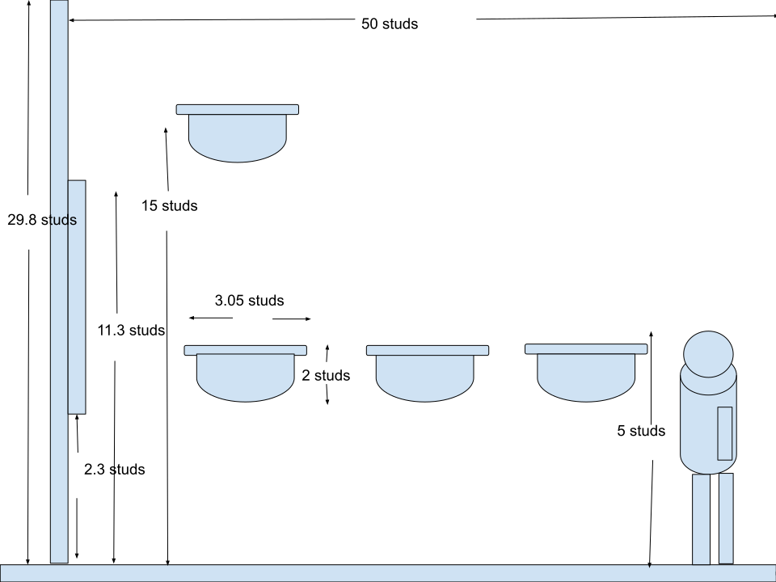
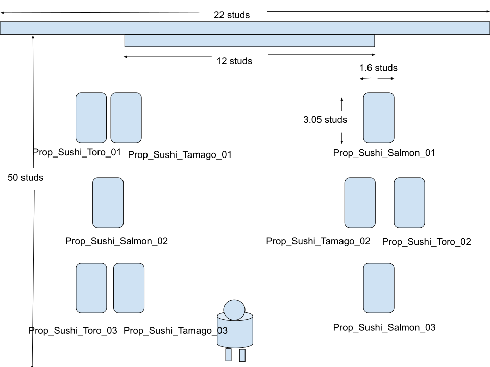

# Roblox Zone C Tsukiji Outer Market Area Design Spec

本ドキュメントは `room-spatial-dimension-spec.md` および `info-board-featured-spots.md` に基づき、Zone C の MainWall_04（南側）に位置する **InfoBoard_13_TsukijiOuterMarket** 前地区の立体空間デザイン、立面・平面レイアウト仕様、ならびに周辺に配置する3Dフードプロップ（寿司オブジェクト等）の配置トランスフォームおよび動的出現アニメーション制御仕様を定義する。

## 🏛️ Area Overview & Spatial Concept

InfoBoard_13_TsukijiOuterMarket 前地区は、築地場外市場の活気ある海鮮・寿司カルチャーを体験・視認できる Zone C の主要展示エリアである。
壁面に備え付けられた主要観光案内板（InfoBoard_13）を中心に、前面の Zone C 床面（Y = 0.2 studs）および案内板上方（Y = 15.0 studs）に立体的なフードプロップ（トロ、タマゴ、サーモンの各種寿司 3D Model）を展開する。
プレイヤーが案内板に接近した際、進行方向および視線に沿ってインタラクティブに寿司プロップが浮き出る演出を構築し、没入感を高める設計とする。

## 📐 Elevation & Plan Layout Specifications

本エリアの立面および平面の構成・寸法仕様は、アセットとして管理されている以下の SVG 設計図面に準拠する。

### 1. 立面仕様 (Elevation Spec)
* **参照アセット**: `tsukiji-outer-market-elevation-spec.svg` (`./roblox-world/assets/tsukiji-outer-market-elevation-spec.svg`)
  
* **主要構造**:
  * **MainWall_04**: 高さ 30.0 studs / 厚み 2.0 studs / 木目調仕上げ
  * **InfoBoard_13_TsukijiOuterMarket**: 
    * Wall Mount 中心高さ: Y = 7.00 studs
    * Size: 12.0, 9.0, 0.4 studs
    * 表面 Display_Surface (SurfaceGui 1024x768): 左側エリア解説文 / 右側場外市場ビジュアル画像
  * **Floor Placement Level**: Zone C 床面 Top Elevation Y = 0.20 studs （床面プロップ設置基準面: Y = 4.00 studs / 空中プロップ設置基準面: Y = 15.00 studs）

### 2. 平面仕様 (Plan Spec)
* **参照アセット**: `tsukiji-outer-market-plan-spec.svg` (`./roblox-world/assets/tsukiji-outer-market-plan-spec.svg`)

* **レイアウト軸**:
  * MainWall_04 壁面位置: Z = 107.00 studs
  * InfoBoard_13 配置位置: X = 22.00 studs, Z = 105.00 studs
  * 展示プロップ群展開領域: X = 15.0 ~ 37.0 studs, Z = 68.0 ~ 94.0 studs （InfoBoard_13 前方の歩行・視認ゾーン）

## 🍣 3D Object & Prop Deployment Transform Table

InfoBoard_13 前地区の床面（Y = 4.0 studs）および案内板上方（Y = 15.0 studs）に調整・配置された 3D オブジェクト（寿司プロップ群）の座標一覧。
Zone B 側（Z = 68.50）から InfoBoard 側（Z = 93.50）、および案内板上方（Z = 101.79 ~ 102.59）へと進行方向に沿って3列＋上方の順次出現シーケンスが組まれている。

### Prop Placement Table

| Prop Name / Object ID | Item Type / Description | Position (X, Y, Z) | Orientation (Rx, Ry, Rz) | Parent Folder / Workspace Hierarchy | Sequential Step |
| :--- | :--- | :--- | :--- | :--- | :--- |
| **Prop_Sushi_Toro_03** | Fatty Tuna / トロ (列1: Zone B側) | (34.20, 4.00, 68.50) | (0, 0, 0) | Workspace.Props.TsukijiArea / Prop_Sushi_Toro_03 | Step 1 (同時) |
| **Prop_Sushi_Tamago_03** | Egg / タマゴ (列1: Zone B側) | (30.96, 4.00, 68.50) | (0, 0, 0) | Workspace.Props.TsukijiArea / Prop_Sushi_Tamago_03 | Step 1 (同時) |
| **Prop_Sushi_Salmon_03** | Salmon / サーモン (列1: Zone B側) | (16.50, 4.00, 68.50) | (0, 0, 0) | Workspace.Props.TsukijiArea / Prop_Sushi_Salmon_03 | Step 2 |
| **Prop_Sushi_Toro_02** | Fatty Tuna / トロ (列2: 中央) | (15.80, 4.00, 81.00) | (0, 0, 0) | Workspace.Props.TsukijiArea / Prop_Sushi_Toro_02 | Step 3 (同時) |
| **Prop_Sushi_Tamago_02** | Egg / タマゴ (列2: 中央) | (19.40, 4.00, 81.00) | (0, 0, 0) | Workspace.Props.TsukijiArea / Prop_Sushi_Tamago_02 | Step 3 (同時) |
| **Prop_Sushi_Salmon_02** | Salmon / サーモン (列2: 中央) | (34.50, 4.00, 81.00) | (0, 0, 0) | Workspace.Props.TsukijiArea / Prop_Sushi_Salmon_02 | Step 4 |
| **Prop_Sushi_Toro_01** | Fatty Tuna / トロ (列3: 看板前) | (36.20, 4.00, 93.50) | (0, 0, 0) | Workspace.Props.TsukijiArea / Prop_Sushi_Toro_01 | Step 5 (同時) |
| **Prop_Sushi_Tamago_01** | Egg / タマゴ (列3: 看板前) | (31.80, 4.00, 93.50) | (0, 0, 0) | Workspace.Props.TsukijiArea / Prop_Sushi_Tamago_01 | Step 5 (同時) |
| **Prop_Sushi_Salmon_01** | Salmon / サーモン (列3: 看板前) | (18.50, 4.00, 93.50) | (0, 0, 0) | Workspace.Props.TsukijiArea / Prop_Sushi_Salmon_01 | Step 6 |
| **Prop_Sushi_Toro_04** | Fatty Tuna / トロ (上方) | (30.04, 15.00, 101.79) | (0, 0, 0) | Workspace.Props.TsukijiArea / Prop_Sushi_Toro_04 | Step 7 (同時) |
| **Prop_Sushi_Tamago_04** | Egg / タマゴ (上方) | (26.62, 15.00, 102.59) | (0, 0, 0) | Workspace.Props.TsukijiArea / Prop_Sushi_Tamago_04 | Step 7 (同時) |
| **Prop_Sushi_Salmon_04** | Salmon / サーモン (上方) | (20.00, 15.00, 102.00) | (0, 0, 0) | Workspace.Props.TsukijiArea / Prop_Sushi_Salmon_04 | Step 7 (同時) |

## ⚡ Dynamic Appearance & Audio System Architecture

本エリアのプロップ出現ギミックは、`InfoBoard_13_TsukijiOuterMarket` 内に配置された Lua スクリプト `Tsukiji_PropController` によって制御される。

### 1. 検出およびトリガー制御
* **感知距離**: プレイヤーのアバター（HumanoidRootPart）が `InfoBoard_13_TsukijiOuterMarket` から **40 studs** 以内に接近したことを `RunService.Heartbeat` で検知。
* **トリガー条件**: 最短距離にあるプレイヤーが 40 studs 以内に入った際に出現シーケンスを開始し、40 studs 外に全員が離れた場合は全プロップを非表示状態にリセットする。

### 2. ポップアップアニメーション & SE再生メカニズム
* **サウンド一括管理**: 
  * `Workspace.AudioAssets` フォルダ配下にポップサウンドアセット **`SE_Pop_Common`** (`SoundId: rbxassetid://100517105966579`) を配置して一括管理する。
* **浮き出るアニメーション演出 (TweenService)**:
  * スクリプト初期化時に全寿司プロップの `CanCollide` を `false` に設定し、プレイヤーの移動・通り抜けを妨げない構造とする。
  * 各プロップの出現時、下方向（-5 studs オフセット）および縮小状態（スケール 0.2）から元の位置・サイズへ `Enum.EasingStyle.Back` および `Enum.EasingDirection.Out` を用いて約 0.35 秒間で飛び出すポップアップ補間を行う。
  * ポップアップ演出の開始と同時に `SE_Pop_Common` の再生位置をリセット (`TimePosition = 0`) して「ポンッ」という効果音を連続再生する。

### 3. 時間差出現シーケンス (Zone B 側から進行方向へ)
Zone B 側から看板方向へ進むプレイヤーの動線に合わせて、以下の 7 ステップ（各ステップ間隔: DELAY_TIME = 0.25〜0.3 秒）で時間差出現を行う。

  Step 1: 【列1 (Zone B側)】 Prop_Sushi_Toro_03 & Prop_Sushi_Tamago_03 が SE とともにポップアップ出現
  Step 2: 【列1 (Zone B側)】 Prop_Sushi_Salmon_03 が SE とともにポップアップ出現
  Step 3: 【列2 (中央)】 Prop_Sushi_Toro_02 & Prop_Sushi_Tamago_02 が SE とともにポップアップ出現
  Step 4: 【列2 (中央)】 Prop_Sushi_Salmon_02 が SE とともにポップアップ出現
  Step 5: 【列3 (看板前)】 Prop_Sushi_Toro_01 & Prop_Sushi_Tamago_01 が SE とともにポップアップ出現
  Step 6: 【列3 (看板前)】 Prop_Sushi_Salmon_01 が SE とともにポップアップ出現
  Step 7: 【上方 (看板上)】 Prop_Sushi_Toro_04 & Prop_Sushi_Tamago_04 & Prop_Sushi_Salmon_04 が SE とともに同時ポップアップ出現

## 📂 Workspace Hierarchy & Integration

築地エリアの全オブジェクト、スクリプト、およびサウンドアセットは、以下の階層構造に従って `Workspace` 内に整理・格納する。

    Workspace
    ├── 🏛️ Walls
    │    └── MainWall_04
    │         └── 🖼️ InfoBoard_13_TsukijiOuterMarket
    │              └── 📜 Tsukiji_PropController (Script)
    ├── 📦 Props
    │    └── 📁 TsukijiArea
    │         ├── Prop_Sushi_Toro_01
    │         ├── Prop_Sushi_Toro_02
    │         ├── Prop_Sushi_Toro_03
    │         ├── Prop_Sushi_Toro_04
    │         ├── Prop_Sushi_Tamago_01
    │         ├── Prop_Sushi_Tamago_02
    │         ├── Prop_Sushi_Tamago_03
    │         ├── Prop_Sushi_Tamago_04
    │         ├── Prop_Sushi_Salmon_01
    │         ├── Prop_Sushi_Salmon_02
    │         ├── Prop_Sushi_Salmon_03
    │         └── Prop_Sushi_Salmon_04
    └── 🔊 AudioAssets
         └── 🎵 SE_Pop_Common (Sound)

## 🔗 Related Documentation & Links

* メインインデックス: `../index.md`
* 全体オブジェクト配置計画: `../object-deployment-plan.md`
* 空間座標・寸法計算仕様書: `./room-spatial-dimension-spec.md`
* 主要観光スポット案内板仕様書: `./info-board-featured-spots.md`
* ワークスペース階層仕様書: `./workspace-hierarchy.md`
