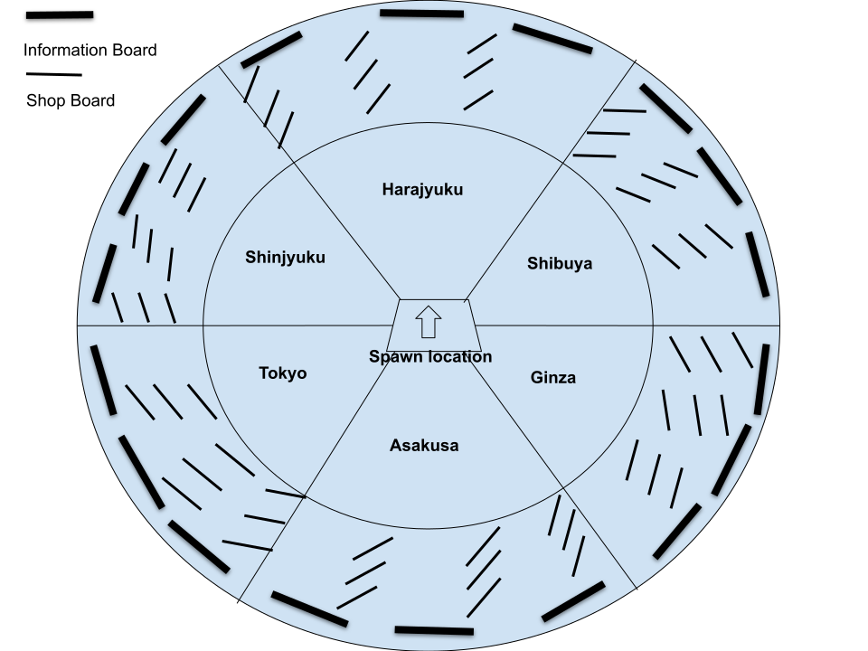

# Roblox Room Layout & Spatial Design Spec

## 📐 Room Layout Diagram

*※ 設計図の元データ・編集は Google Draw 参照*

---

## 🏛️ Architecture & Room Shape
空間全体は同心円状の3つのゾーン構造と、それを囲む12面体の外壁で構成される。

* **Room Shape (12面体の外壁):** 
  全体を包み込む外壁は12面体で構成される。
  * **メインウォール:** モノトーンの大きな板（6枚）。
  * **サブウォール:** 大きな板の間に配置される薄い板（6枚）。11月の旅行というテーマに合わせ「紅葉柄」を採用。
* **Radial Division (6大エリア分割):** 
  空間を中央から放射状に6つの主要エリア（扇形セクター）へ分割。
  * **1st Trip Hemisphere (前半ゾーン):** Shinjuku / Harajuku / Shibuya
  * **2nd Trip Hemisphere (後半ゾーン):** Tokyo / Asakusa / Ginza

---

## 🗺️ Spatial Zoning & Board Placement
空間は中心から外側へ向かって、**Zone A**, **Zone B**, **Zone C** の3つの同心円状の階層に役割が分かれている。

### Zone A (入場・全体把握エリア)
空間の中心となるエントリーゾーン。
* **Spawn Location:** 非可視化（透明化）された状態で設置されており、プレイヤーの入場エリアとなる。
* **Future Expansion:** 将来的に余裕があれば、観光予定地の目安を感じさせるための中央オブジェクトとして「東京23区地図」の表示を検討。

### Zone B (交流・宿泊・インタラクションエリア)
プレゼン参加者がお互いに降り立ち、交流や情報共有を行う中間ゾーン。
* **Information Boards:** 各エリアに応じたホテル情報ボード（Hotel Board）を配置。
* **Interactive Elements:** DataStore を活用した「意見書き込みチャットボックス」および「投票ボックス」を設置予定。
* **Boundary to Zone C:** Zone Cとの境界線上には、各エリアの雰囲気を表すゲートなどの **Iconic Major Landmarks** を設置し、視覚的な区切りを設ける。

### Zone C (観光スポット・詳細情報エリア)
外周部に位置する、観光情報が集中するメイン展示ゾーン。
* **Outer Wall Information:** 12面体の外壁に沿って、大型の案内板（Featured Sightseeing Spots）を配置。
* **Floating Shop Boards:** 中間部には、円形で空中に浮遊するような配置で店舗・施設ボード（Specific Spot & Shop Boards）を設置。
* **Spatial Decoration:** 空間の空中に Small Prop & Detail Objects を飾り、エリアごとのテーマ性や賑わいを強調する。

---

## 🎨 Design & Aesthetics
* **Theme:** Modern Virtual Meeting Room / Autumn Cyber-Travel Museum (11月の旅行を意識した紅葉テイストをブレンド).
* **Lighting:** エリアごとの雰囲気を際立たせるアンビエントライティングの設定。紅葉柄の外壁や空中のプロップが効果的に映えるよう調整。
* **Object Properties:** 各ボードおよびプロップは原則として 'Anchored = true' に設定し、安定した展示空間を構築する。
